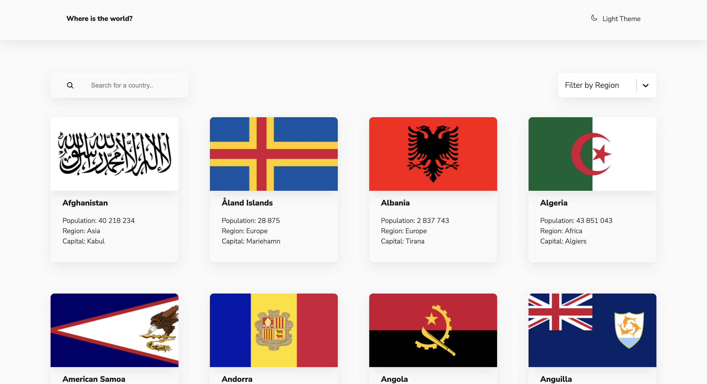
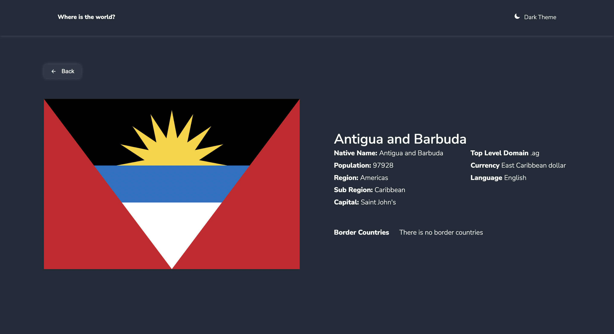
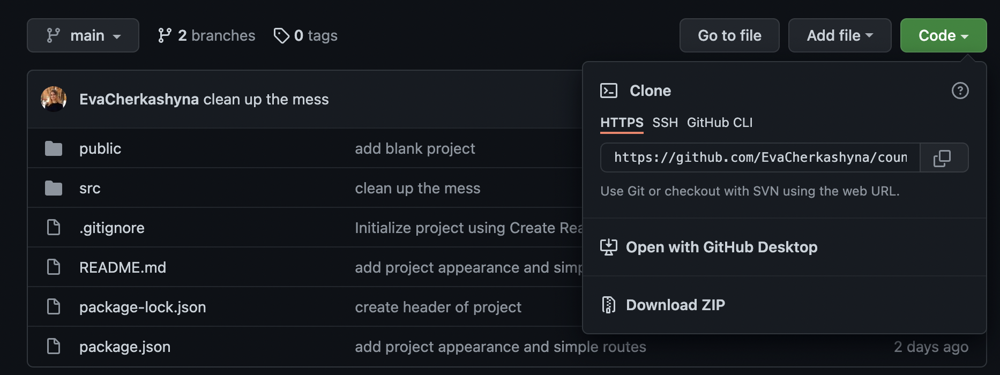

# Description 
In this project, you can find a country by region or name, and see information about it.

# Project creation process
I created this test project in [frontend-mentors](https://www.frontendmentor.io/challenges/rest-countries-api-with-color-theme-switcher-5cacc469fec04111f7b848ca). This project used [React](https://ru.reactjs.org/) and [Countries-Api](https://restcountries.com/#api-endpoints-v2).

# Filter by region and search by name
Search and filter can work both together and separately.

# Country information
By clicking on the country you can find out:
+ Native Name
+ Population
+ Region
+ Sub Region
+ Capital
+ Top Level Domain 
+ Currency 
+ Language 
+ Border Countries

You also have the opportunity to go to neighboring countries or back.

# Dark theme
If you are not a fan of the white theme, a dark theme is available in the project.

# Demo 
You can see my demo: [demo](https://evacherkashyna.github.io/countries-project). (Click on words `Where is the world?`)

# Download instructions

1. Copy the link you can find by clicking on the green `code` button.
2. Write in terminal: `git clone link`.
3. The project will be copied to the selected folder.
